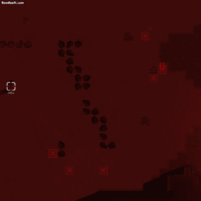

# 림월드 모드: 캣후루의 각성 (Cathulu Awake)

## 📖 소개
**Cathulu Awake**는 림월드(RimWorld)의 Anomaly DLC와 냐론(Nyaron) 종족 모드를 기반으로 한 확장 모드입니다.

## ✨ 주요 기능 (Key Features)

### 1. 실체들 (현재 1종 구현)
* **다중 공격 패턴**: 원거리 공격, 광역기(AoE), 그리고 플레이어 기지의 벽을 파괴하는 폭발 공격 등 다양한 패턴을 구사하는 강력한 보스 몬스터가 등장합니다.(예정)
* **평범한 플레이를 함정에 빠트리는 다양한 기믹 추가**: 플레이어의 상식을 역이용하는 다양한 기믹들이 추가됩니다. 

## 🛠️ 기술 스택 및 구현 상세 (Technical Details)

* **환경**: C# (.NET Framework 4.8), XML(VScode), Visual Studio 2026, RimWorld 라이브러리
* **게임 로직 후킹 및 분석**: `Assembly-CSharp.dll` 디컴파일 및 심층 분석을 통해 바닐라 림월드의 시스템을 확장하여 커스텀 팩션 및 퀘스트 발생 조건을 설계했습니다.
* ** 날씨/이벤트 제어 (`GameCondition`)**:
  * 기존 게임에서 사용하는 컴포넌트(GameCondition, GameComponent 등)들을 상속하고 재정의하여 독자적인 새로운 게임 환경 구축.
  * 게임 내부에 플레이어 Pawn의 일상적 행동(Ingest, Door Access, Do job)메서드, CodexEntity(실체도감)의 생성자(Constructor)와 매개변수 등 Harmony로 접근 및 패치(Prefix/Postfix)작업으로 여러가지 기믹을 추가하였습니다.
  * Unity엔진 기능을 활용하여 다양한 시각적 효과와 연출을 추가하였습니다.
  * 외부 자료와 게임 내부 맴버간의 데이터 교환을 위한 다양한 xml 파일을 작성했습니다.(게임 XML 파싱로직에 대한 이해)

## 🎨 아트 및 리소스 (Art Assets)

* 기존 게임 에셋(스프라이트, 쉐이더)등을 재활용하여, 전혀 다른 새로운 효과를 만들어내거나(Fleck,Mote,Effector 등), 새로 추가하여 더욱 발전된 시각적 요소를 추가하였습니다.

## ✨ 프로젝트 구성

* 1.6 : 현재 림월드의 최신버전(1.6)에 대응하는 dll라이브러리,def가 작성된 xml파일이 있는 폴더입니다.
* About : Mod Config에서 표시되는 썸네일,모드명,디스크립션,의존관계 등 모드의 전반적인 정보가 포함된 내용이 작성된 폴더입니다.
* Textures : 현재 모드에 사용한 에셋 중 core에 포함되지 않는 커스텀 그래픽 에셋이 포함된 폴더입니다.
* Source : cs파일 및 솔루션 프로젝트(소스)가 포함된 폴더입니다.

  
  

